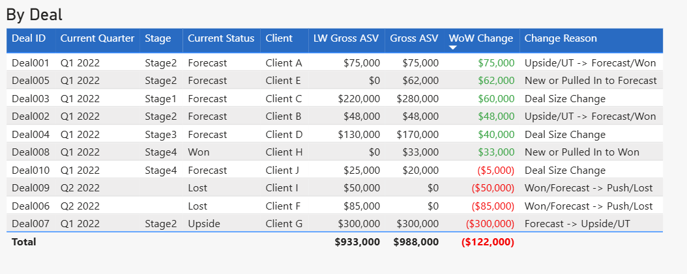
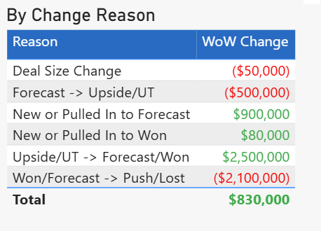

This DAX formula tells the user what the Week Over Week (WoW) change for each deal has been. 
For example, if Business XYZ had a dollar value of $283,112 last week and this week it has a dollar value of $321,112, then it will display $38,000. 
By using conditional formatting in Power BI one can make it easy for the user to see whether it's a negative, neutral, or positive change.


```dax

Metric_Change_Justification = 
SWITCH(
    TRUE(),
    -- Moved Out (Forecast/Won to Push/Lost)
    (Prev_Status IN {"Forecast", "Won"}) && 
    (Is_Shifted_Out || ISBLANK(Category) || Exclusion_Flag <> 0),
    "Won/Forecast -> Push/Lost",

    -- Moved Out but Not in Forecast/Won
    Is_Shifted_Out,
    "Shifted Out",

    -- New or Moved In to Forecast/Won
    (Is_New || Is_Shifted_In) && Curr_Status IN {"Forecast", "Won"},
    IF(Curr_Status = "Forecast", "New or Pulled In to Forecast", "New or Pulled In to Won"),

    -- Status Upgrade (Upside/UT to Forecast/Won)
    Prev_Status = "Upside/UT" && 
    Curr_Status IN {"Forecast", "Won"},
    "Upside/UT -> Forecast/Won",

    -- Status Downgrade (Forecast to Upside/UT)
    Prev_Status IN {"Forecast"} && 
    Curr_Status = "Upside/UT",
    "Forecast -> Upside/UT",

    -- Value Change in Same Period
    Same_Period && Value_Difference <> 0 && 
    Curr_Status IN {"Forecast", "Won", "Upside/UT"},
    "Deal Size Change",

    BLANK()
)

```


OUTPUT EXAMPLE BY DEAL ID

Note: the formula above is reponsible for the "Change Reason" column. Also, WoW Change displays $75K in the first row even though the dollar value of the opportunity didn't change. That's because once it moves into Change Reason Forecast/Won, it couunts as a positive addition to this week's forecast. 



OUTPUT EXAMPLE BY CHANGE REASON


