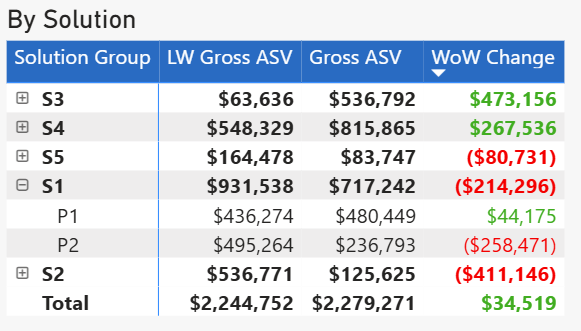

This DAX formula tells the user what the Week Over Week (WoW) change for each deal has been. 
For example, if Business XYZ had a dollar value of $283,112 last week and this week it has a dollar value of $321,112, then it will display $38,000. 
By using conditional formatting in Power BI one can make it easy for the user to see whether it's a negative, neutral, or positive change.


```dax

Metric_Change = 
SUMX(
    'Data_Table',
    VAR Prev_Status = 'Data_Table'[Previous_Period_Status]
    VAR Curr_Status = 'Data_Table'[Current_Period_Status]
    VAR Is_Shifted_Out = 'Data_Table'[Is_Shifted_Out]
    VAR Is_Shifted_In = 'Data_Table'[Is_Shifted_In]
    VAR Is_New = ISBLANK('Data_Table'[Previous_Period_Date])
    VAR Same_Period = 'Data_Table'[Previous_Period_Date] = 'Data_Table'[Current_Period_Date]
    VAR Value_Change = [Current_Value] - [Previous_Value]
    RETURN
    SWITCH(
        TRUE(),
        -- Deals Moved Out (Forecast/Won to Push/Lost) (-)
        (Prev_Status IN {"Forecast", "Won"}) && 
        (Is_Shifted_Out || ISBLANK('Data_Table'[Category]) || 'Data_Table'[Exclusion_Flag] <> 0),
        -[Previous_Value],

        -- New or Shifted-In Deals to Forecast/Won (+)
        (Is_New || Is_Shifted_In) && Curr_Status IN {"Forecast", "Won"},
        IF(Curr_Status = "Forecast", [Current_Value], IF(Curr_Status = "Won", [Current_Value], BLANK())),

        -- Status Changes: Upside/UT to Forecast/Won (+)
        Prev_Status = "Upside/UT" && 
        Curr_Status IN {"Forecast", "Won"},
        [Current_Value],

        -- Status Changes: Forecast to Upside/UT (-)
        Prev_Status = "Forecast" && 
        Curr_Status = "Upside/UT",
        -[Previous_Value],

        -- Value Changes in Same Period (+ or -)
        Same_Period && Value_Change <> 0 && 
        Curr_Status IN {"Forecast", "Won", "Upside/UT"},
        Value_Change,

        BLANK()
    )
)


```


OUTPUT EXAMPLE BY DEAL ID

The formula above is reponsible for the "WoW Change" column. Note that WoW Change displays $75K in the first row even though the dollar value of the opportunity didn't change. That's because once it moves into Change Reason Forecast/Won, it couunts as a positive addition to this week's forecast. 


OUTPUT EXAMPLE BY SOLUTION





OUTPUT EXAMPLE BY FRONT LINE MANAGER


